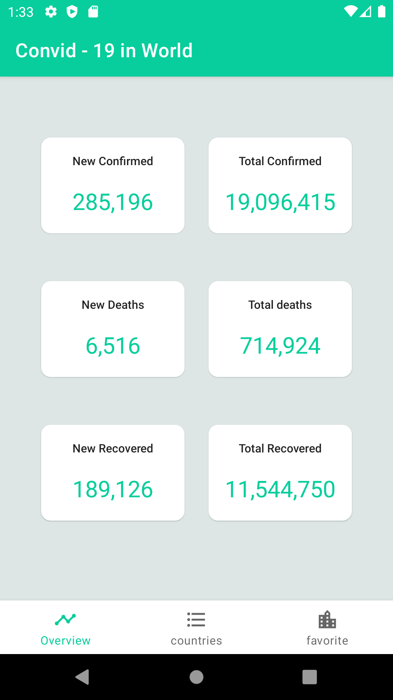
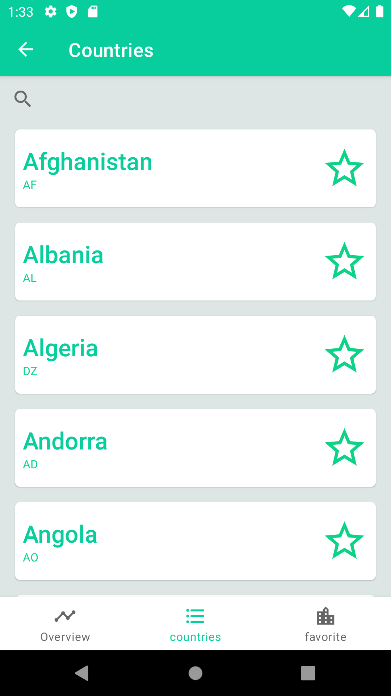
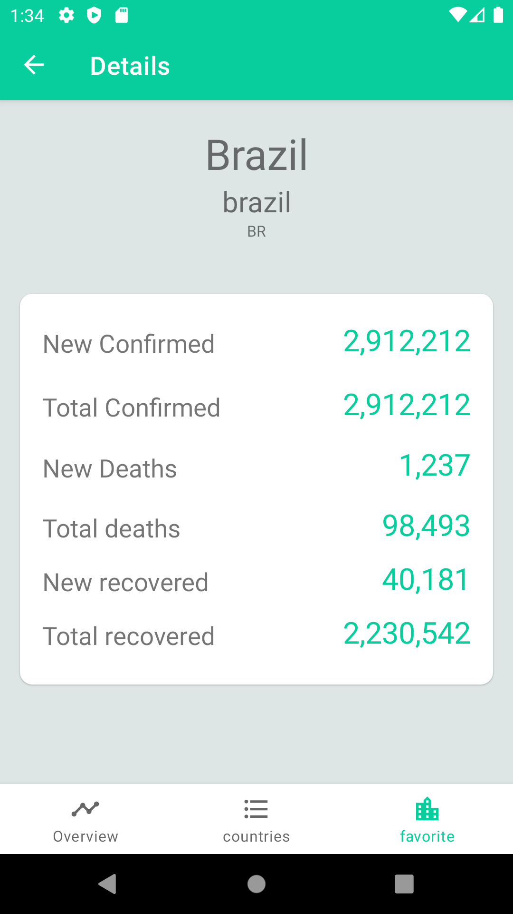

# Monitoramento de casos de covid-19 mundial

Este aplicativo monstra as estatísticas de casos de covid 19, mundialmente incluindo, número de mortes, 
número de recuperados, número de novos casos diáriamente.

## Apresentação

<p align="left">
   &nbsp;&nbsp;
   &nbsp;&nbsp;
  
</p>


<p align="left">
   &nbsp;&nbsp; 
</p>


## Instalação

Faça o clone deste repositório:
```bash
git clone https://github.com/Kdiaseng/StatisticCovidApp.git
```

## Tecnologias utilizadas
- Arquitetura MVVM;
- DataBinding;
- Retrofi2t;
- Navigation component;

## API
https://documenter.getpostman.com/view/10808728/SzS8rjbc?version=latest#00030720-fae3-4c72-8aea-ad01ba17adf8


